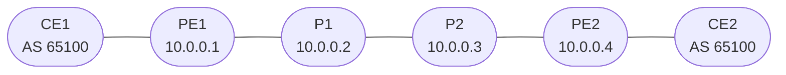

# Junos SP Training Labs

These labs are designed for adult professionals learning Juniper Networks service provider concepts using **vMX** (Junos 14.1, VCP-only) in **GNS3**. The series maps to the **JNCIS-SP** (JN0-362) exam objectives and assumes you have already completed a CCNA-level routing & switching foundation.

---

## What You Will Build

By the end of this series you will have configured and verified a complete MPLS service provider network from scratch — including IGP, BGP, LDP, and L3 VPNs — using the same Junos CLI and configuration hierarchy used in production ISP environments.

---

## Lab Series

| Session | Topic | Key Skills |
|---------|-------|------------|
| [Session 1](session1/index.md) | GNS3 Platform & Junos CLI | vMX setup, operational/config modes, commit/rollback |
| [Session 2](session2/index.md) | Interfaces & Static Routing | ge-0/0/X config, family inet, loopbacks, static routes |
| [Session 3](session3/index.md) | Bridging & VLANs | Bridge domains, 802.1Q trunks, access ports, IRB inter-VLAN routing |
| [Session 4](session4/index.md) | OSPF Single-Area | Area 0, neighbor adjacency, LSAs, passive interfaces |
| [Session 5](session5/index.md) | IS-IS | Level 1/2, NET addressing, redistribution |
| [Session 6](session6/index.md) | BGP | eBGP, iBGP, route reflectors, routing policies |
| [Session 7](session7/index.md) | MPLS & LDP | Label switching, LDP neighbor, RSVP-TE intro |
| [Session 7a](session7a/index.md) | Layer 2 Services *(self-directed)* | L2circuit, VPLS |
| [Session 8](session8/index.md) | BGP/MPLS L3 VPN | VRF, route distinguisher, route target, MP-BGP |
| [Session 9](session9/index.md) | Capstone Troubleshooting | Multi-fault diagnosis across all layers |

---

## Technical Requirements

| Component | Requirement |
|-----------|-------------|
| GNS3 | 2.2.44 or later |
| GNS3 VM | 2.2.44 (VMware Workstation or VirtualBox) |
| vMX image | Junos 14.1R4.8 `hda.qcow2` (from Juniper support portal) |
| RAM per node | 2048 MB |
| vCPUs per node | 1 |
| Nodes per lab | 4–6 (16–24 GB host RAM recommended) |
| Host OS | Windows 10/11 or Linux |

!!! warning "Boot time & first boot reboot"
    vMX takes **3–5 minutes** to boot. Do not attempt configuration until the `root@%` prompt appears. On the **first boot of a fresh image**, vMX prints a network-services warning and requires an immediate `request system reboot` before proceeding — this is normal and only happens once.

---

## Key Differences from Cisco IOS

If you are coming from the Cisco CCNA lab series, these are the most important Junos concepts to internalize before starting:

| Cisco IOS | Junos OS |
|-----------|----------|
| `interface GigabitEthernet0/0` | `set interfaces ge-0/0/0 unit 0 ...` |
| `ip address 10.1.1.1 255.255.255.0` | `set interfaces ge-0/0/0 unit 0 family inet address 10.1.1.1/24` |
| `no shutdown` (required) | Interfaces are **enabled by default** |
| `show ip route` | `show route` |
| `show ip ospf neighbor` | `show ospf neighbor` |
| Running-config is live | Config is **staged** — `commit` to apply |
| `copy run start` | Not needed — `commit` persists to storage |
| ACLs | **Firewall filters** with named terms |
| VRF | **Routing instance** (`instance-type vrf`) |

!!! tip "The commit model"
    Junos uses a two-stage configuration model. All changes you type are staged in a **candidate configuration**. Nothing changes on the router until you run `commit`. You can always discard with `rollback 0` or revert to the last good state with `rollback 1`.
