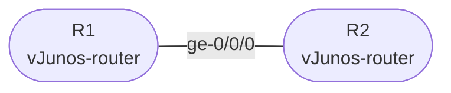

# Session 1 — Topology

## Diagram

## Device Summary

| Device | Role | Image |
|--------|------|-------|
| R1 | Router | vJunos-router (Junos 23.2R1+) |
| R2 | Router | vJunos-router (Junos 23.2R1+) |

## Link Summary

| Link | R1 Interface | R2 Interface |
|------|-------------|-------------|
| R1 — R2 | ge-0/0/0 | ge-0/0/0 |

## Notes

This session uses only two routers with a single link. The topology expands to four provider routers and two customer routers in Session 3 and remains constant from Session 3 through Session 8.

No IP addressing is configured in this session. Interface configuration begins in Session 2.
