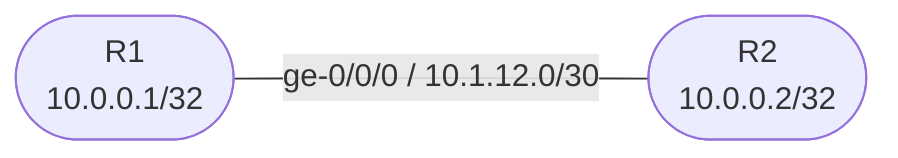

# Session 2 — Interfaces & Static Routing

## Objectives

By the end of this session you will be able to:

- [ ] Configure Junos physical interfaces with IPv4 addresses
- [ ] Configure loopback interfaces (`lo0`) — the Junos equivalent of IOS `interface Loopback0`
- [ ] Verify interface state with `show interfaces terse` and `show interfaces detail`
- [ ] Configure static routes under `routing-options`
- [ ] Configure a default route and verify reachability end-to-end

## Prerequisites

- Session 1 complete — both R1 and R2 boot and have hostnames set
- Understanding of Junos operational vs configuration mode and the commit model

## Topology Overview

## Addressing Table

| Device | Interface | Address | Purpose |
|--------|-----------|---------|---------|
| R1 | `ge-0/0/0` | `10.1.12.1/30` | WAN link to R2 |
| R1 | `lo0.0` | `10.0.0.1/32` | Loopback (router ID) |
| R2 | `ge-0/0/0` | `10.1.12.2/30` | WAN link to R1 |
| R2 | `lo0.0` | `10.0.0.2/32` | Loopback (router ID) |

## Session Parts

| Part | Topic |
|------|-------|
| [Part 0](tasks/part0.md) | Base config (hostname, root password) |
| [Part 1](tasks/part1.md) | Physical interface addressing |
| [Part 2](tasks/part2.md) | Loopbacks and static routes |
| [Part 3](tasks/part3.md) | Default route and verification |
| [Verification](tasks/verify.md) | Checklist |
