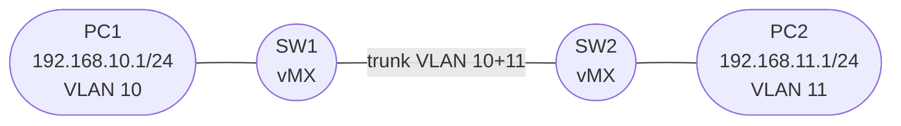

# Session 3 — Bridging & VLANs

## Objectives

By the end of this session you will be able to:

- [ ] Change the vMX network-services mode to `enhanced-ethernet` and reboot
- [ ] Define bridge domains with VLAN IDs in Junos
- [ ] Configure access ports (untagged) for PC endpoints
- [ ] Configure trunk ports (tagged, multiple VLANs) between two vMX switches
- [ ] Verify MAC address learning in a bridge domain
- [ ] Add IRB interfaces for inter-VLAN routing

## Prerequisites

- Sessions 1 and 2 complete — you can boot vMX nodes and configure interfaces
- GNS3 project with two vMX nodes and two VPCS nodes available

## Topology Overview

Two vMX routers act as Layer 2 switches using Junos **bridge domains**. A trunk link carries both VLANs between them. PC1 (VLAN 10) and PC2 (VLAN 11) are isolated by default — VLAN 10 traffic cannot cross into VLAN 11 without a router.

## Session Parts

| Part | Topic |
|------|-------|
| [Part 0](tasks/part0.md) | Base config — enable enhanced-ethernet mode |
| [Part 1](tasks/part1.md) | Bridge domains and access ports |
| [Part 2](tasks/part2.md) | Trunk configuration |
| [Part 3](tasks/part3.md) | IRB for inter-VLAN routing |
| [Verification](tasks/verify.md) | Checklist |

!!! warning "VCP-only limitation"
    This session uses vMX in VCP-only mode (no separate VFP). Bridge domain traffic is forwarded by the RE in software. The configuration and verification commands all work correctly — packet forwarding functions but at lower throughput than a production MX with a VFP.
