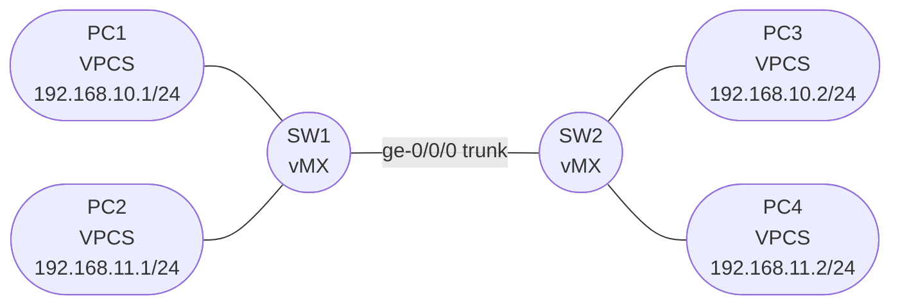

# Session 3 — Topology

## Diagram

## Device Summary

| Device | Role | Image | GNS3 Node |
|--------|------|-------|-----------|
| SW1 | Layer 2 switch (bridge domains) | vMX 14.1R4.8 | vMX-14.1 template |
| SW2 | Layer 2 switch (bridge domains) | vMX 14.1R4.8 | vMX-14.1 template |
| PC1 | End host, VLAN 10 (on SW1) | VPCS | Built-in GNS3 |
| PC2 | End host, VLAN 11 (on SW1) | VPCS | Built-in GNS3 |
| PC3 | End host, VLAN 10 (on SW2) | VPCS | Built-in GNS3 |
| PC4 | End host, VLAN 11 (on SW2) | VPCS | Built-in GNS3 |

## Link Summary

| Link | SW Interface | PC/SW Interface | Type |
|------|-------------|----------------|------|
| SW1 — SW2 | ge-0/0/0 (Adapter 2) | ge-0/0/0 (Adapter 2) | 802.1Q trunk, VLANs 10 + 11 |
| SW1 — PC1 | ge-0/0/1 (Adapter 3) | eth0 | Access, VLAN 10 (untagged) |
| SW1 — PC2 | ge-0/0/2 (Adapter 4) | eth0 | Access, VLAN 11 (untagged) |
| SW2 — PC3 | ge-0/0/1 (Adapter 3) | eth0 | Access, VLAN 10 (untagged) |
| SW2 — PC4 | ge-0/0/2 (Adapter 4) | eth0 | Access, VLAN 11 (untagged) |

## Notes

- PC1 and PC3 are both in VLAN 10 — they can communicate at Layer 2 across the trunk without routing
- PC2 and PC4 are both in VLAN 11 — same behaviour
- VLAN 10 and VLAN 11 are isolated from each other; cross-VLAN communication requires IRB (Part 3)
- SW1 holds the IRB interfaces that act as the default gateway for both VLANs
