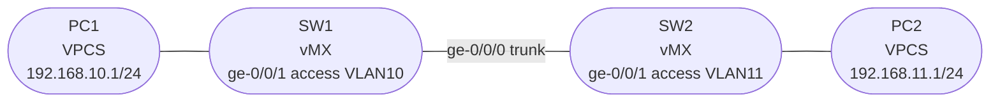

# Session 3 — Topology

## Diagram

## Device Summary

| Device | Role | Image | GNS3 Node |
|--------|------|-------|-----------|
| SW1 | Layer 2 switch (bridge domains) | vMX 14.1R4.8 | vMX-14.1 template |
| SW2 | Layer 2 switch (bridge domains) | vMX 14.1R4.8 | vMX-14.1 template |
| PC1 | End host, VLAN 10 | VPCS | Built-in GNS3 |
| PC2 | End host, VLAN 11 | VPCS | Built-in GNS3 |

## Link Summary

| Link | SW1 Interface | SW2/PC Interface | Type |
|------|--------------|-----------------|------|
| SW1 — SW2 | ge-0/0/0 (Adapter 2) | ge-0/0/0 (Adapter 2) | 802.1Q trunk, VLANs 10 + 11 |
| SW1 — PC1 | ge-0/0/1 (Adapter 3) | eth0 | Access, VLAN 10 (untagged) |
| SW2 — PC2 | ge-0/0/1 (Adapter 3) | eth0 | Access, VLAN 11 (untagged) |

!!! note "VPCS adapter"
    VPCS nodes only have a single interface (eth0). Connect it to any available adapter on SW1/SW2 using Adapter 3 (ge-0/0/1).

## Notes

- SW1 and SW2 both define VLAN 10 and VLAN 11 bridge domains — the trunk allows both VLANs to span both switches
- PC1 and PC2 are in different VLANs and cannot communicate at Layer 2
- Inter-VLAN routing is added in Part 3 using IRB interfaces on SW1
