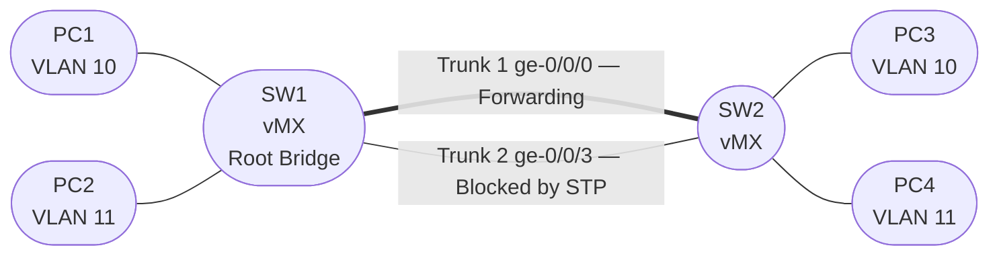

# Session 3a — Spanning Tree Protocol (RSTP)

## Objectives

By the end of this session you will be able to:

- [ ] Explain why STP is required when redundant Layer 2 paths exist
- [ ] Add a second trunk link to create a physical loop
- [ ] Enable RSTP on bridge domains and observe the root bridge election
- [ ] Identify port roles: Root, Designated, and Alternate (blocking)
- [ ] Demonstrate RSTP fast failover by removing the active trunk

## Prerequisites

- Session 3 complete — both vMX switches running in enhanced-ethernet mode with VLAN 10 and VLAN 11 bridge domains configured
- Four VPCS PCs connected and passing traffic

## Why Spanning Tree?

Without STP, a second trunk between two switches creates a loop. Ethernet frames have no TTL — a broadcast sent by PC1 would be forwarded endlessly between SW1 and SW2, consuming all available bandwidth and crashing both switches within seconds.

STP solves this by electing a **root bridge** and logically blocking all redundant paths, leaving exactly one active path between any two devices. If the active path fails, STP unblocks the redundant path to restore connectivity.

**RSTP** (Rapid Spanning Tree, IEEE 802.1w) is the modern version — it converges in under one second instead of the 30–50 seconds required by original STP (802.1D).

## Topology Overview

STP blocks one of the two trunk links, preventing the loop while keeping the redundant path available for failover.

## Session Parts

| Part | Topic |
|------|-------|
| [Part 0](tasks/part0.md) | Enable RSTP on both switches |
| [Part 1](tasks/part1.md) | Add second trunk — RSTP blocks the loop |
| [Part 2](tasks/part2.md) | Port roles and states |
| [Part 3](tasks/part3.md) | RSTP failover test |
| [Verification](tasks/verify.md) | Checklist |

!!! note "vMX 14.1 STP scope"
    On vMX 14.1, RSTP is configured globally under `[edit protocols rstp]` — there is no per-bridge-domain STP stanza. A single RSTP instance covers all bridge domains.
