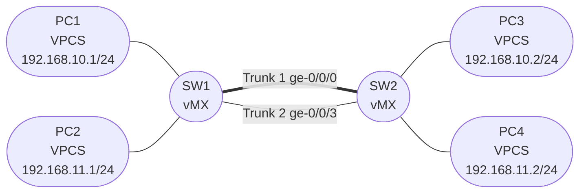

# Session 3a — Topology

## Diagram

## Device Summary

| Device | Role | STP Role |
|--------|------|----------|
| SW1 | Layer 2 switch | Root bridge (bridge-priority 4096) |
| SW2 | Layer 2 switch | Non-root bridge (bridge-priority 32768) |
| PC1–PC4 | End hosts | N/A |

## Link Summary

| Link | SW1 Interface | SW2 Interface | Type | STP State |
|------|--------------|--------------|------|-----------|
| Trunk 1 | ge-0/0/0 (Adapter 2) | ge-0/0/0 (Adapter 2) | 802.1Q trunk | Forwarding |
| Trunk 2 | ge-0/0/3 (Adapter 5) | ge-0/0/3 (Adapter 5) | 802.1Q trunk | Blocked (SW2 alternate) |
| SW1 — PC1 | ge-0/0/1 (Adapter 3) | — | Access VLAN 10 | Edge / Forwarding |
| SW1 — PC2 | ge-0/0/2 (Adapter 4) | — | Access VLAN 11 | Edge / Forwarding |
| SW2 — PC3 | ge-0/0/1 (Adapter 3) | — | Access VLAN 10 | Edge / Forwarding |
| SW2 — PC4 | ge-0/0/2 (Adapter 4) | — | Access VLAN 11 | Edge / Forwarding |

## Notes

- The STP state in the table above reflects the expected state after SW1 is elected root bridge
- The actual blocked port may be on either switch depending on port costs and MAC addresses — the root bridge's ports are always Designated (forwarding)
- PC access ports are configured as **edge ports** in RSTP — they transition immediately to forwarding without going through the listening/learning states
