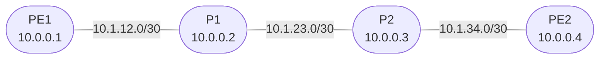

# Session 5 — IS-IS Single-Area

## Objectives

By the end of this session you will be able to:

- [ ] Explain what a NET address is and derive one from a loopback IP
- [ ] Remove OSPF and replace it with IS-IS on a four-router backbone
- [ ] Configure IS-IS Level 2 on all provider interfaces
- [ ] Verify IS-IS adjacency and read the link-state database
- [ ] Confirm full loopback reachability via IS-IS

## Prerequisites

- Session 4 complete — OSPF running on PE1, P1, P2, PE2 with full loopback reachability
- The `JNCIS-SP-Core` GNS3 project is open and all four nodes are running

## IS-IS Protocol Overview

IS-IS (Intermediate System to Intermediate System) was designed by the **ISO** (International Organization for Standardization) as the routing protocol for **OSI** (Open Systems Interconnection) networks. In the OSI model, a router is called an **Intermediate System (IS)** and a host is called an **End System (ES)** — hence the name.

Originally, IS-IS was built to route **CLNP** (Connectionless Network Protocol), the OSI equivalent of IP. In 1990, **RFC 1195** extended IS-IS to also carry IP routing information, creating what is commonly called **Integrated IS-IS**. This is the version used in all modern SP networks and on Junos.

### How IS-IS Works

IS-IS is a **link-state** protocol, which means every router builds a complete map of the network and runs **SPF** (Shortest Path First — the Dijkstra algorithm) locally to compute the best path to each destination. The same fundamental mechanism as OSPF, but with different packet types and addressing.

The protocol operates in three steps:

1. **Adjacency formation** — routers send **IIH** (IS-IS Hello) PDUs on each interface to discover neighbors and negotiate hold timers. IS-IS hellos carry **SNPA** (Subnetwork Point of Attachment) addresses — the MAC address on Ethernet — rather than IP addresses. This is why IS-IS runs at Layer 2.

2. **LSP flooding** — once adjacent, each router generates an **LSP** (Link State PDU) describing its links and reachable prefixes. LSPs are flooded to all routers in the level. The collection of all LSPs forms the **LSDB** (Link State Database). **CSNP** (Complete Sequence Number PDU) and **PSNP** (Partial Sequence Number PDU) messages keep the LSDB synchronized.

3. **SPF computation** — each router independently runs SPF on its LSDB copy to build a shortest-path tree and install routes.

### IS-IS Levels

IS-IS uses two routing levels instead of OSPF-style areas:

| Level | Scope | Equivalent in OSPF |
|-------|-------|-------------------|
| **Level 1 (L1)** | Intra-area routing | Non-backbone area |
| **Level 2 (L2)** | Inter-area / backbone routing | Area 0.0.0.0 |
| **L1/L2** | Both — connects L1 areas to the L2 backbone | ABR |

In a simple SP backbone with no customer routing, only Level 2 is needed. This session disables Level 1 on all routers, making the backbone a flat Level 2 domain — the most common configuration in real ISP networks.

### LSPs and TLVs

IS-IS encodes all information inside LSPs using **TLV** (Type-Length-Value) fields. Each TLV carries a specific type of information: IP reachability, IS neighbors, area addresses, and so on. This extensible format is why IS-IS was straightforward to extend for MPLS traffic engineering and segment routing — new TLVs were simply defined without changing the base protocol.

On broadcast (multi-access) segments, IS-IS elects a **DIS** (Designated Intermediate System) — equivalent to OSPF's DR — to reduce LSP flooding overhead. On point-to-point links (as used in this lab), no DIS election occurs.

## Why IS-IS Instead of OSPF?

Both are link-state IGPs that serve the same purpose: flooding topology information so every router can compute the best path. Most enterprise networks use OSPF. Most large service providers — AT&T, Verizon, NTT, and others — run IS-IS as their backbone IGP.

| Property | OSPF | IS-IS |
|----------|------|-------|
| Runs over | IP | Layer 2 (directly over data link) |
| Address family | IPv4 only (OSPFv2) | Protocol-agnostic — IPv4, IPv6, MPLS TLVs in one |
| Extension model | Opaque LSAs (bolt-on) | Native TLVs — cleaner for TE and SR |
| Stability | Well-understood | Resilient to IP misconfiguration (hellos don't need IP) |

IS-IS running directly over Layer 2 means a misconfigured IP address cannot prevent IS-IS hellos from being sent — a useful property in large SP deployments.

## Topology Overview

Same four-router topology as Session 4. IP addressing does not change — only the IGP changes.

## Session Parts

| Part | Topic |
|------|-------|
| [Part 0](tasks/part0.md) | Remove OSPF & configure IS-IS |
| [Part 1](tasks/part1.md) | Verify IS-IS adjacency and routes |
| [Verification](tasks/verify.md) | Checklist |
