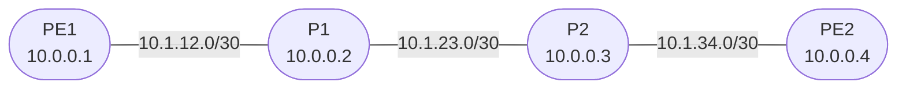

# Session 5 — IS-IS Single-Area

## Objectives

By the end of this session you will be able to:

- [ ] Explain what a NET address is and derive one from a loopback IP
- [ ] Remove OSPF and replace it with IS-IS on a four-router backbone
- [ ] Configure IS-IS Level 2 on all provider interfaces
- [ ] Verify IS-IS adjacency and read the link-state database
- [ ] Confirm full loopback reachability via IS-IS

## Prerequisites

- Session 4 complete — OSPF running on PE1, P1, P2, PE2 with full loopback reachability
- The `JNCIS-SP-Core` GNS3 project is open and all four nodes are running

## Why IS-IS Instead of OSPF?

Both are link-state IGPs that serve the same purpose: flooding topology information so every router can compute the best path. Most enterprise networks use OSPF. Most large service providers — AT&T, Verizon, NTT, and others — run IS-IS as their backbone IGP.

| Property | OSPF | IS-IS |
|----------|------|-------|
| Runs over | IP | Layer 2 (directly over data link) |
| Address family | IPv4 only (OSPFv2) | Protocol-agnostic — IPv4, IPv6, MPLS TLVs in one |
| Extension model | Opaque LSAs (bolt-on) | Native TLVs — cleaner for TE and SR |
| Stability | Well-understood | Resilient to IP misconfiguration (hellos don't need IP) |

IS-IS running directly over Layer 2 means a misconfigured IP address cannot prevent IS-IS hellos from being sent — a useful property in large SP deployments.

## Topology Overview

Same four-router topology as Session 4. IP addressing does not change — only the IGP changes.

## Session Parts

| Part | Topic |
|------|-------|
| [Part 0](tasks/part0.md) | Remove OSPF & configure IS-IS |
| [Part 1](tasks/part1.md) | Verify IS-IS adjacency and routes |
| [Verification](tasks/verify.md) | Checklist |
