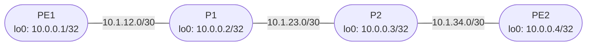

# Session 5 — Topology

## Diagram

## Device Summary

| Device | Role | Loopback | IS-IS NET |
|--------|------|----------|-----------|
| PE1 | Provider Edge | 10.0.0.1/32 | 49.0001.0100.0000.0001.00 |
| P1 | Provider Core | 10.0.0.2/32 | 49.0001.0100.0000.0002.00 |
| P2 | Provider Core | 10.0.0.3/32 | 49.0001.0100.0000.0003.00 |
| PE2 | Provider Edge | 10.0.0.4/32 | 49.0001.0100.0000.0004.00 |

## Link Summary

| Link | Left Device | Left Interface | Left Address | Right Device | Right Interface | Right Address |
|------|------------|---------------|-------------|-------------|----------------|--------------|
| PE1 — P1 | PE1 | ge-0/0/0 | 10.1.12.1/30 | P1 | ge-0/0/0 | 10.1.12.2/30 |
| P1 — P2 | P1 | ge-0/0/1 | 10.1.23.1/30 | P2 | ge-0/0/0 | 10.1.23.2/30 |
| P2 — PE2 | P2 | ge-0/0/1 | 10.1.34.1/30 | PE2 | ge-0/0/0 | 10.1.34.2/30 |

## Notes

This is the same GNS3 project and topology from Session 4. No new links or nodes are needed. IS-IS replaces OSPF in-place — the interface IP addresses and loopbacks remain unchanged.
