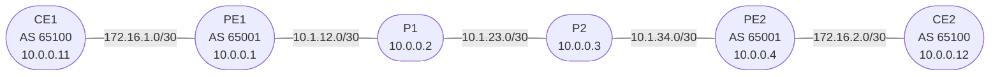

# Session 6 — BGP

## Objectives

By the end of this session you will be able to:

- [ ] Explain the difference between eBGP and iBGP and when each is used
- [ ] Configure eBGP peering between a PE router and a CE router
- [ ] Configure iBGP peering between two PE routers using loopback addresses
- [ ] Explain why `next-hop-self` is required for iBGP to work across a provider core
- [ ] Read the BGP table and trace a prefix from CE1 through the provider to CE2
- [ ] Explain the iBGP full mesh rule and how Route Reflectors solve it

## Prerequisites

- Session 5 complete — IS-IS running on PE1, P1, P2, PE2 with full loopback reachability
- The `JNCIS-SP-Core` GNS3 project is open and all four provider nodes are running

## BGP Protocol Overview

BGP (Border Gateway Protocol) is the routing protocol that holds the internet together. Every ISP, cloud provider, and large enterprise exchanges routing information with its neighbors using BGP. It is the only EGP (Exterior Gateway Protocol) in widespread use today.

Unlike IS-IS and OSPF — which are link-state protocols that flood topology and compute shortest paths — BGP is a **path vector** protocol. Instead of building a map of the network, BGP advertises **reachability**: "I can reach prefix X, and the path to get there goes through these autonomous systems."

### Autonomous Systems

An **AS** (Autonomous System) is a network under a single administrative domain with a consistent routing policy. Each AS is identified by an **ASN** (Autonomous System Number). In this lab:

| AS | ASN | Routers |
|----|-----|---------|
| Provider | 65001 | PE1, P1, P2, PE2 |
| Customer A | 65100 | CE1, CE2 |

ASNs 64512–65534 are private (like RFC 1918 for IP) — used in labs and internal deployments.

### eBGP vs iBGP

BGP has two operating modes depending on whether the peering is within or between autonomous systems:

| Property | eBGP | iBGP |
|----------|------|------|
| Between | Different ASes | Same AS |
| Typical use | PE-CE peering | PE-PE peering across provider core |
| TTL default | 1 (direct link) | 255 (multihop) |
| NEXT_HOP behavior | Set to peering address | Unchanged (requires next-hop-self) |
| AS_PATH | Prepend own ASN | Not modified |

In this lab, PE1 runs **eBGP** with CE1 and **iBGP** with PE2. P1 and P2 do not run BGP at all — they are pure IS-IS transit routers.

### BGP Session Establishment

BGP sessions run over **TCP port 179**. The session lifecycle:

1. **OPEN** — each peer sends its ASN, BGP version, hold time, and router ID
2. **KEEPALIVE** — sent to confirm the OPEN and maintain the session (default every 30s)
3. **UPDATE** — carries **NLRI** (prefix advertisements) and withdrawals
4. **NOTIFICATION** — signals an error and tears down the session

Once both peers exchange KEEPALIVEs the session reaches **Established** state and UPDATE messages begin flowing.

### BGP Path Selection (Simplified)

When BGP receives the same prefix from multiple peers, it selects one best path using a sequence of tiebreakers. The most important attributes in order:

| Step | Attribute | Prefer |
|------|-----------|--------|
| 1 | LOCAL_PREF | Highest |
| 2 | AS_PATH length | Shortest |
| 3 | ORIGIN | IGP > EGP > Incomplete |
| 4 | MED | Lowest |
| 5 | eBGP over iBGP | eBGP |
| 6 | IGP cost to next-hop | Lowest |

In this session only one path exists for each prefix, so path selection is not exercised — but these attributes appear in `show route detail` output.

### iBGP Full Mesh Rule

iBGP does not re-advertise routes learned from one iBGP peer to another iBGP peer. This prevents routing loops within the AS but creates a requirement: **every iBGP speaker must peer with every other iBGP speaker** (full mesh).

With two PE routers this is one session (PE1 ↔ PE2) — trivial. With ten PE routers it would be 45 sessions. The solution is a **Route Reflector (RR)**: a designated router that re-advertises iBGP routes to its **RR clients**, eliminating the full mesh requirement.

In this lab the full mesh is manageable (one session), so no RR is configured. Session 8 (L3 VPN) introduces MP-BGP and the RR design becomes relevant at scale.

### Why Loopbacks for iBGP Peering

iBGP peers in this lab use their **loopback addresses** (10.0.0.1 and 10.0.0.4) as the BGP source and neighbor address, rather than the physical interface IPs. This provides resilience: if one physical link between PE1 and PE2 goes down but IS-IS finds an alternate path, the BGP session stays up because the loopback remains reachable.

### next-hop-self

When PE1 receives a prefix from CE1 via eBGP, the **NEXT_HOP** attribute is set to CE1's IP address (172.16.1.2). When PE1 re-advertises this prefix to PE2 via iBGP, the NEXT_HOP is **not changed by default** — PE2 would see a next-hop of 172.16.1.2, which it cannot reach (it has no route to the 172.16.1.0/30 subnet).

`next-hop-self` tells PE1 to replace the NEXT_HOP with its own loopback (10.0.0.1) when advertising to iBGP peers. PE2 has IS-IS reachability to 10.0.0.1, so the route becomes usable.

### A Note on End-to-End Forwarding

By the end of this session both PE routers will have CE1's and CE2's loopbacks in their BGP tables, and both CEs will have each other's loopbacks via eBGP. However, **a ping from CE1 to CE2's loopback will fail** — the packet reaches PE1, which forwards it toward PE2 via IS-IS, but the transit P routers (P1, P2) do not have routes to CE prefixes. They only know IS-IS routes.

This is the problem MPLS solves: in Session 7, P routers forward based on labels rather than destination IP, so they do not need to know customer prefixes. End-to-end CE-to-CE connectivity is the payoff of Session 7.

## Topology Overview

CE1 and CE2 are added to the GNS3 project in Part 0. P1 and P2 do not run BGP.

## Session Parts

| Part | Topic |
|------|-------|
| [Part 0](tasks/part0.md) | Expand topology — add CE nodes, configure interfaces |
| [Part 1](tasks/part1.md) | eBGP PE-CE peering and prefix advertisement |
| [Part 2](tasks/part2.md) | iBGP PE-PE peering with loopback addresses |
| [Verification](tasks/verify.md) | Checklist |
