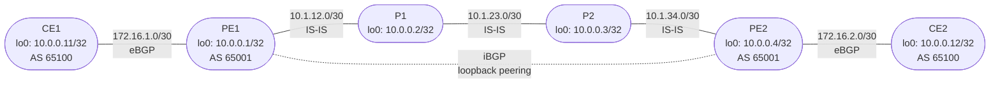

# Session 6 — Topology

## Diagram

## Device Summary

| Device | Role | ASN | Loopback | Runs BGP? |
|--------|------|-----|----------|-----------|
| CE1 | Customer Edge | 65100 | 10.0.0.11/32 | Yes — eBGP to PE1 |
| PE1 | Provider Edge | 65001 | 10.0.0.1/32 | Yes — eBGP + iBGP |
| P1 | Provider Core | 65001 | 10.0.0.2/32 | No — IS-IS only |
| P2 | Provider Core | 65001 | 10.0.0.3/32 | No — IS-IS only |
| PE2 | Provider Edge | 65001 | 10.0.0.4/32 | Yes — eBGP + iBGP |
| CE2 | Customer Edge | 65100 | 10.0.0.12/32 | Yes — eBGP to PE2 |

## Link Summary

| Link | Left Device | Left Interface | Left Address | Right Device | Right Interface | Right Address |
|------|------------|---------------|-------------|-------------|----------------|--------------|
| CE1 — PE1 | CE1 | ge-0/0/0 | 172.16.1.2/30 | PE1 | ge-0/0/1 | 172.16.1.1/30 |
| PE1 — P1 | PE1 | ge-0/0/0 | 10.1.12.1/30 | P1 | ge-0/0/0 | 10.1.12.2/30 |
| P1 — P2 | P1 | ge-0/0/1 | 10.1.23.1/30 | P2 | ge-0/0/0 | 10.1.23.2/30 |
| P2 — PE2 | P2 | ge-0/0/1 | 10.1.34.1/30 | PE2 | ge-0/0/0 | 10.1.34.2/30 |
| PE2 — CE2 | PE2 | ge-0/0/1 | 172.16.2.1/30 | CE2 | ge-0/0/0 | 172.16.2.2/30 |

## GNS3 New Links (Part 0)

Two new links are added in Part 0:

| Link | Node A | Adapter | Node B | Adapter |
|------|--------|---------|--------|---------|
| CE1 — PE1 | CE1 | 2 (ge-0/0/0) | PE1 | 3 (ge-0/0/1) |
| CE2 — PE2 | CE2 | 2 (ge-0/0/0) | PE2 | 3 (ge-0/0/1) |

## BGP Session Summary

| Session | Type | Local Router | Local Address | Peer | Peer Address | Peer AS |
|---------|------|-------------|--------------|------|-------------|---------|
| CE1 — PE1 | eBGP | CE1 | 172.16.1.2 | PE1 | 172.16.1.1 | 65001 |
| PE1 — CE1 | eBGP | PE1 | 172.16.1.1 | CE1 | 172.16.1.2 | 65100 |
| PE1 — PE2 | iBGP | PE1 | 10.0.0.1 (lo0) | PE2 | 10.0.0.4 (lo0) | 65001 |
| PE2 — PE1 | iBGP | PE2 | 10.0.0.4 (lo0) | PE1 | 10.0.0.1 (lo0) | 65001 |
| PE2 — CE2 | eBGP | PE2 | 172.16.2.1 | CE2 | 172.16.2.2 | 65100 |
| CE2 — PE2 | eBGP | CE2 | 172.16.2.2 | PE2 | 172.16.2.1 | 65001 |
