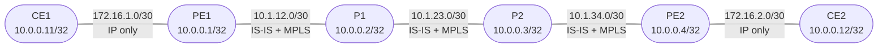

# Session 7 — MPLS & LDP

## Objectives

By the end of this session you will be able to:

- [ ] Explain what MPLS is and why service providers use it instead of pure IP forwarding
- [ ] Describe the difference between LER, LSR, LSP, FEC, and PHP
- [ ] Explain why LDP and RSVP-TE exist and when each is used
- [ ] Enable MPLS and LDP on the four-router provider backbone
- [ ] Read the LDP neighbor table, label database, and inet.3 routing table
- [ ] Explain why inet.3 exists and how BGP uses it to resolve next-hops
- [ ] Verify end-to-end CE-to-CE reachability using label switching
- [ ] Configure a basic RSVP-TE LSP and verify it with show commands

## Prerequisites

- Session 6 complete — IS-IS running on PE1, P1, P2, PE2; BGP sessions up between PE1/PE2 and CE1/CE2; CE-to-CE prefix knowledge confirmed
- The `JNCIS-SP-Core` GNS3 project is open with all six nodes running

## What Is MPLS?

**MPLS** (Multiprotocol Label Switching) is a data-plane forwarding mechanism that replaces per-hop IP lookups with a simple label swap operation. Instead of every router performing a longest-prefix match on the full routing table for every packet, the first router in the MPLS domain stamps a short fixed-length **label** onto each packet, and every transit router that follows simply reads that label, swaps it for a new one, and forwards — no IP lookup required.

The label is 32 bits wide, inserted between the Layer 2 header and the IP header. Twenty bits carry the label value itself. Three bits are the **TC** (Traffic Class) field used for QoS. One bit is the **S** (bottom-of-stack) flag — set on the innermost label. Eight bits are the **TTL** field. This 4-byte shim is sometimes called the MPLS shim header or MPLS label stack entry.

Because labels are short and the label lookup is a simple exact-match operation (not a longest-prefix search), forwarding through an MPLS core is faster and more predictable than IP-based forwarding. More importantly, it decouples what the packet carries from how it is forwarded — the same forwarding plane can carry IPv4, IPv6, Layer 2 frames, and VPN traffic using the same label mechanism.

## Why and When to Use MPLS

### P Routers Do Not Need Customer Routes

In Session 6 you configured BGP so CE1 and CE2 exchange prefixes. The BGP knowledge is correct — PE1 knows CE2's loopback and vice versa. But a ping from CE1 to CE2 still fails. The reason: P1 and P2 are pure IS-IS routers. When PE1 forwards a packet toward CE2 (10.0.0.12), the packet reaches P1, P1 does an IP lookup, finds no route to 10.0.0.12, and drops it.

Two solutions exist:

1. Run BGP on P1 and P2 so they carry customer routes — this is called **full BGP table in the core**. It works but scales poorly. A tier-1 ISP has hundreds of thousands of BGP prefixes. Putting that on every transit router is expensive and fragile.

2. Use **MPLS** — PE1 pushes a label that represents "deliver this to PE2." P1 and P2 swap labels without ever looking at the IP destination. They do not need to know anything about CE prefixes. They only need to know how to reach PE2 by following labels.

MPLS is the industry solution. It keeps the core lean — P routers carry only IS-IS routes and a label forwarding table.

### Traffic Engineering

Pure IP routing sends every packet on the same shortest-path computed by the IGP. MPLS-TE (Traffic Engineering) allows an operator to route traffic along an **explicit path** regardless of what the IGP prefers. This enables:

- Routing traffic around a congested link
- Reserving bandwidth for specific flows (a 10 Gbps video stream gets its own guaranteed path)
- Precomputing a backup path that can be activated in under 50 ms (Fast Reroute)

### VPN Services

MPLS is the foundation for SP VPN services. **L3 VPN** (Session 8) uses a **label stack**: an inner VPN label identifies which customer VRF the packet belongs to, and an outer transport label carries it across the core. The P routers only see the outer label — they have no knowledge of VPN routing tables. **L2 services** (Session 7a) use the same label stack to carry customer Ethernet frames transparently across the provider backbone.

### Summary: When to Use MPLS

| Use Case | Reason |
|----------|--------|
| SP backbone with CE customers | P routers avoid carrying customer/BGP routes |
| Traffic engineering | Explicit paths, bandwidth reservation, Fast Reroute |
| L3 VPN (BGP/MPLS VPN) | Label stack separates customer VRFs without per-customer routing on P routers |
| L2 VPN (L2circuit, VPLS) | Transparent Layer 2 connectivity across an IP/MPLS backbone |

MPLS is not typically used in small enterprise or campus networks where the routing table is small and IP forwarding is sufficient.

## How MPLS Forwards Packets

Forwarding happens in three operations:

**Push** — The ingress **LER** (Label Edge Router, i.e., the PE router) classifies the incoming packet into a **FEC** (Forwarding Equivalence Class — essentially "all packets going to this destination"). It selects the label for that FEC and stamps it onto the packet before forwarding.

**Swap** — Each **LSR** (Label Switch Router, i.e., a P router) receives a labeled packet, looks up the incoming label in its **LFIB** (Label Forwarding Information Base), replaces it with the outgoing label for the next hop, and forwards. No IP lookup occurs.

**Pop** — The egress LER (or the router before it, via PHP) removes the label and delivers the inner IP packet.

In this lab:

```
CE1 --> PE1 [Push] --> P1 [Swap] --> P2 [Swap/PHP Pop] --> PE2 [Pop/deliver] --> CE2
```

### Penultimate Hop Popping (PHP)

PHP is an optimization. The router one hop before the egress PE (P2 in this lab for the PE1→PE2 direction) sends **implicit-null** (label value 3) as its label binding for the egress PE's loopback. This tells the upstream router (P1) to **pop the label** before forwarding instead of swapping. The egress PE receives a plain IP packet and avoids one label lookup — saving a small amount of processing at the busiest point in the flow.

PHP is enabled by default in Junos and most implementations.

## Roles in the MPLS Network

| Term | Full Name | Role in this lab |
|------|-----------|-----------------|
| **LER** | Label Edge Router | PE1 and PE2 — push labels on ingress, pop on egress |
| **LSR** | Label Switch Router | P1 and P2 — swap labels, no IP lookup |
| **LSP** | Label Switched Path | The end-to-end label path from PE1 to PE2 |
| **FEC** | Forwarding Equivalence Class | The destination prefix a label represents |
| **LFIB** | Label Forwarding Information Base | Per-router table of incoming label → outgoing label + interface |
| **PHP** | Penultimate Hop Popping | P2 pops the label before handing off to PE2 |

## LDP vs RSVP-TE

Two protocols distribute labels in Junos SP deployments:

| Property | LDP | RSVP-TE |
|----------|-----|---------|
| Full name | Label Distribution Protocol | Resource Reservation Protocol — Traffic Engineering |
| Path selection | Follows IGP shortest path | Explicit or CSPF-computed path |
| Bandwidth reservation | No | Yes |
| Configuration complexity | Low | Higher — requires TE extensions in IGP |
| Typical use | Baseline label distribution, L3 VPN transport | Traffic engineering, guaranteed-bandwidth LSPs, Fast Reroute |
| Standard | RFC 5036 | RFC 3209 |

**This session configures LDP** for all four provider links and then introduces a basic RSVP-TE LSP in Part 3. In production networks both often run simultaneously — LDP for baseline connectivity and RSVP-TE for specific engineered paths.

## inet.3 — The MPLS Routing Table

Junos uses a separate routing table, **inet.3**, to hold MPLS-resolved next-hops. When LDP runs, routes to provider loopbacks appear in inet.3 with label operations (Push, Swap, Pop) as the next-hop action.

BGP uses inet.3 to resolve its next-hops. When PE1 has a BGP route to 10.0.0.12 with next-hop 10.0.0.4, it looks up 10.0.0.4 in inet.3 (not inet.0). If inet.3 has an LDP entry for 10.0.0.4 with a Push action, BGP installs the route with the label stack. This is why P routers do not need BGP — the label in the packet tells P1 and P2 where to send it without any IP lookup.

Before MPLS: BGP resolves 10.0.0.4 via inet.0 → IS-IS route → IP forwarding through P routers → P routers drop packet (no route to 10.0.0.12).

After MPLS: BGP resolves 10.0.0.4 via inet.3 → LDP LSP → label forwarding through P routers → P routers swap labels → PE2 delivers to CE2.

## Topology Overview



MPLS and LDP run only on the four provider backbone links. The PE-CE links remain pure IP — CE routers are outside the MPLS domain. No new GNS3 nodes are added in this session.

## Session Parts

| Part | Topic |
|------|-------|
| [Part 0](tasks/part0.md) | Verify Session 6 state and add `family mpls` to provider interfaces |
| [Part 1](tasks/part1.md) | Enable `protocols mpls` and `protocols ldp` on all provider routers |
| [Part 2](tasks/part2.md) | Verify label distribution, inet.3, and CE-to-CE reachability |
| [Part 3](tasks/part3.md) | RSVP-TE intro — configure a basic signaled LSP from PE1 to PE2 |
| [Verification](tasks/verify.md) | Checklist |
