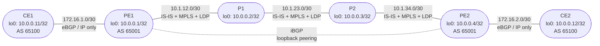

# Session 7 — Topology

## Diagram

Same six-router topology as Session 6. No new nodes or GNS3 links are added. MPLS and LDP are enabled only on the four provider backbone links — the PE-CE links remain pure IP.

## Device Summary

| Device | Role | Loopback | Runs MPLS? | Runs LDP? |
|--------|------|----------|------------|-----------|
| CE1 | Customer Edge | 10.0.0.11/32 | No | No |
| PE1 | Provider Edge (LER) | 10.0.0.1/32 | Yes — ge-0/0/0 | Yes |
| P1 | Provider Core (LSR) | 10.0.0.2/32 | Yes — ge-0/0/0, ge-0/0/1 | Yes |
| P2 | Provider Core (LSR) | 10.0.0.3/32 | Yes — ge-0/0/0, ge-0/0/1 | Yes |
| PE2 | Provider Edge (LER) | 10.0.0.4/32 | Yes — ge-0/0/0 | Yes |
| CE2 | Customer Edge | 10.0.0.12/32 | No | No |

## Link Summary

| Link | Left Device | Left Interface | Left Address | Right Device | Right Interface | Right Address | MPLS? |
|------|------------|---------------|-------------|-------------|----------------|--------------|-------|
| CE1 — PE1 | CE1 | ge-0/0/0 | 172.16.1.2/30 | PE1 | ge-0/0/1 | 172.16.1.1/30 | No |
| PE1 — P1 | PE1 | ge-0/0/0 | 10.1.12.1/30 | P1 | ge-0/0/0 | 10.1.12.2/30 | Yes |
| P1 — P2 | P1 | ge-0/0/1 | 10.1.23.1/30 | P2 | ge-0/0/0 | 10.1.23.2/30 | Yes |
| P2 — PE2 | P2 | ge-0/0/1 | 10.1.34.1/30 | PE2 | ge-0/0/0 | 10.1.34.2/30 | Yes |
| PE2 — CE2 | PE2 | ge-0/0/1 | 172.16.2.1/30 | CE2 | ge-0/0/0 | 172.16.2.2/30 | No |

## MPLS-Enabled Interfaces

| Router | Interface | Direction |
|--------|-----------|-----------|
| PE1 | ge-0/0/0.0 | Toward P1 |
| P1 | ge-0/0/0.0 | Toward PE1 |
| P1 | ge-0/0/1.0 | Toward P2 |
| P2 | ge-0/0/0.0 | Toward P1 |
| P2 | ge-0/0/1.0 | Toward PE2 |
| PE2 | ge-0/0/0.0 | Toward P2 |

The loopback (lo0.0) is added to LDP on every provider router so LDP uses the loopback as its transport address — this makes the LDP session independent of any single physical link.
