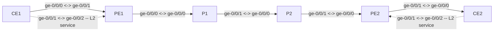

# Session 7a — Layer 2 Services (Self-Directed)

!!! note "Self-directed bonus session"
    This session is optional and not required to proceed to Session 8. It explores Layer 2 VPN services that run over the MPLS backbone built in Session 7. Complete Session 7 first — LDP must be operational before starting here.

## Overview

In Session 8 you will build a **Layer 3 VPN (L3 VPN)**, where the provider takes ownership of IP routing on behalf of the customer. The customer hands off IP packets and the provider routes them between sites using VRFs and MP-BGP.

**Layer 2 VPN services** work differently — the provider delivers a raw Ethernet connection between customer sites and the customer runs their own routing on top. From the customer's perspective it looks like a direct Ethernet cable between sites. From the provider's perspective that "cable" is a pseudowire carried across the MPLS backbone.

This model is valuable for several reasons:

- **Customer controls routing** — enterprises with their own routing protocols (OSPF, EIGRP, BGP) can run them between sites without the provider touching routing tables
- **Protocol transparency** — any Layer 2 protocol (STP, LACP, LLDP) passes through unchanged
- **Simple service model** — the customer does not need to coordinate with the provider on addressing, routing policy, or BGP ASNs
- **Legacy and multi-vendor support** — some applications assume they are on the same LAN; L2 VPN satisfies that requirement without relocating equipment

Two distinct services are covered in this session:

### L2circuit — Point-to-Point Pseudowire

An **L2circuit** connects exactly two sites. PE1 and PE2 each have a CE-facing interface configured as a Circuit Cross-Connect (CCC). Traffic arriving on PE1's CE-facing interface is encapsulated with two MPLS labels and forwarded across the backbone to PE2, where the labels are stripped and the original Ethernet frame is delivered to CE2.

The two-label stack:

- **Outer label** — the LDP transport label established in Session 7. P routers swap or pop this label to forward the packet hop-by-hop through the backbone. P routers do not know or care what is inside.
- **Inner label** — the L2circuit VC label. PE2 uses this to identify which pseudowire the frame belongs to and deliver it out the correct CE-facing interface.

This is the simplest Layer 2 VPN service: one pseudowire, two endpoints, fully transparent to the customer.

### VPLS — Virtual Private LAN Service

**VPLS** (Virtual Private LAN Service) is the multipoint equivalent. Instead of a single wire between two sites, VPLS creates a virtual Ethernet switch that spans multiple PE routers. Customer sites connected to any PE on the VPLS appear to be on the same LAN — MAC learning, ARP, and broadcast all behave as on a normal Ethernet segment.

Under the hood, VPLS builds a full-mesh of pseudowires between every participating PE. When a frame arrives from a CE, the PE:

1. Looks up the destination MAC in its local MAC table
2. If the MAC is known, forwards out the interface it was learned on — either a local CE port or a pseudowire to another PE
3. If the MAC is unknown, floods out all pseudowires and local CE interfaces (split-horizon: never floods back onto the interface the frame arrived on)

VPLS uses BGP to distribute membership — each PE advertises its VPLS site to all other PEs in the same VPN, and BGP carries the label bindings that identify each pseudowire. This extends the same iBGP session already running between PE1 and PE2 with a new address family: `l2vpn signaling`.

## Prerequisites

- Sessions 1–7 complete
- IS-IS adjacencies up on all four provider routers
- LDP sessions `Operational` on all provider links
- `show route table inet.3` on PE1 shows PE2 loopback (10.0.0.4) reachable via LDP

## New GNS3 Links Required

This session requires two new physical connections in GNS3. The existing CE-facing interfaces (PE1 ge-0/0/1 and PE2 ge-0/0/1) carry IP and BGP traffic from Sessions 5–7 and must not be disturbed.

| GNS3 Node | Adapter | Interface | Connects to |
|-----------|---------|-----------|-------------|
| PE1 | 4 | ge-0/0/2 | CE1 Adapter 3 |
| CE1 | 3 | ge-0/0/1 | PE1 Adapter 4 |
| PE2 | 4 | ge-0/0/2 | CE2 Adapter 3 |
| CE2 | 3 | ge-0/0/1 | PE2 Adapter 4 |

In GNS3, stop all nodes, then draw links between the adapters listed above. All six adapters are provisioned by the vMX image at boot — no hardware change is needed. Restart the topology after connecting the links.

## Session Parts

| Part | Topic | New Configuration |
|------|-------|------------------|
| Part 0 | Verify MPLS baseline; add GNS3 links; configure CE test interfaces | CE1 ge-0/0/1, CE2 ge-0/0/1 |
| Part 1 | L2circuit — point-to-point pseudowire | PE1/PE2 ge-0/0/2 CCC encapsulation, `protocols l2circuit` |
| Part 2 | VPLS — virtual LAN service | `family l2vpn signaling` in BGP, `routing-instances` type `vpls` |

## Topology

Solid lines are the existing backbone and BGP links from Sessions 5–7. Dashed lines are the new L2 service interfaces added in this session.
