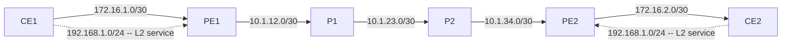

# Session 7a — Topology

## Diagram

The Session 7a topology extends the existing six-router backbone with two new L2 service links. All other connections remain exactly as configured in Sessions 5–7.

The dashed links carry L2 service traffic. The subnet 192.168.1.0/24 is assigned to the CE interfaces — from the CE's perspective this is a direct Ethernet connection to the remote CE. The PE interfaces on these links have no IP address; they are configured as Layer 2 cross-connects.

## Device Summary

| Device | Role | Loopback |
|--------|------|----------|
| PE1 | Provider Edge (ingress) | 10.0.0.1/32 |
| P1 | Provider Core (transit) | 10.0.0.2/32 |
| P2 | Provider Core (transit) | 10.0.0.3/32 |
| PE2 | Provider Edge (egress) | 10.0.0.4/32 |
| CE1 | Customer Edge (Site 1) | 10.0.0.11/32 |
| CE2 | Customer Edge (Site 2) | 10.0.0.12/32 |

## Link Summary

| Link | Interface (A) | Interface (B) | Subnet | Used Since |
|------|--------------|---------------|--------|------------|
| CE1 - PE1 (BGP) | CE1 ge-0/0/0.0 | PE1 ge-0/0/1.0 | 172.16.1.0/30 | Session 5 |
| PE1 - P1 | PE1 ge-0/0/0.0 | P1 ge-0/0/0.0 | 10.1.12.0/30 | Session 4 |
| P1 - P2 | P1 ge-0/0/1.0 | P2 ge-0/0/0.0 | 10.1.23.0/30 | Session 4 |
| P2 - PE2 | P2 ge-0/0/1.0 | PE2 ge-0/0/0.0 | 10.1.34.0/30 | Session 4 |
| PE2 - CE2 (BGP) | PE2 ge-0/0/1.0 | CE2 ge-0/0/0.0 | 172.16.2.0/30 | Session 5 |
| CE1 - PE1 (L2 service) | CE1 ge-0/0/1.0 | PE1 ge-0/0/2.0 | 192.168.1.0/24 (CE side only) | Session 7a |
| CE2 - PE2 (L2 service) | CE2 ge-0/0/1.0 | PE2 ge-0/0/2.0 | 192.168.1.0/24 (CE side only) | Session 7a |

!!! note "PE interface has no IP address"
    PE1 ge-0/0/2 and PE2 ge-0/0/2 are configured as Circuit Cross-Connect (CCC) interfaces in Part 1 and as VPLS access interfaces in Part 2. Neither carries an IP address on the provider side — they are pure Layer 2 ingress/egress points.
