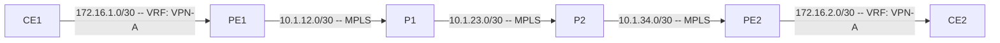

# Session 8 — BGP/MPLS L3 VPN

## Overview

In Sessions 6 and 7 you built a BGP network and an MPLS backbone. The BGP in Session 6 worked — CE1 and CE2 exchanged loopback prefixes — but it had a critical weakness: customer routes lived directly in the PE's global routing table (`inet.0`). Any route PE1 learned from CE1 was visible to every process on the router. In a real service provider network with hundreds of VPN customers, this fails in two ways:

- **No isolation** — if two customers happen to use the same IP address space, their routes collide in `inet.0` and one overwrites the other
- **No scalability** — the global table grows without bound as customers are added

**BGP/MPLS Layer 3 VPN** (RFC 4364, formerly RFC 2547) solves both problems. Each customer gets a dedicated **VRF** (Virtual Routing and Forwarding instance) — a completely separate routing table per customer per PE. Customer A's routes go into `VPN-A.inet.0` and never touch `inet.0` or any other customer's VRF.

### The Three Building Blocks

**VRF — Virtual Routing and Forwarding**

A VRF is a separate routing table with its own forwarding instance. On PE1, the CE1-facing interface (`ge-0/0/1`) is assigned to the VRF rather than the global table. All routes learned from CE1 land in the VRF. All routes advertised to CE1 come from the VRF. The global `inet.0` table never sees customer routes.

**Route Distinguisher (RD)**

Two different customers could both use the prefix `10.1.1.0/24`. If PE1 and PE2 both receive that prefix via iBGP, the BGP process needs to tell them apart. The RD is a 64-bit value prepended to each VPN prefix to make it globally unique: `65001:100:10.1.1.0/24` and `65001:200:10.1.1.0/24` are distinct entries in BGP even if the raw prefix is identical. The RD has no semantic meaning beyond uniqueness — it does not control which VRFs import the route.

**Route Target (RT)**

The RT is a BGP extended community that controls VPN membership. When a PE exports a VPN route to iBGP, it tags the route with an RT. When the receiving PE's VRF has a matching import RT, it pulls the route into its local VRF table. RT is the mechanism that determines which VRFs "belong together" — that is, which customer sites can reach each other.

In this lab, both PE1 and PE2 use `target:65001:100` for Customer A. PE1 exports with that RT, PE2 imports routes carrying that RT — and vice versa. The result: both PEs have the same VPN routes in their VPN-A VRF.

### MP-BGP — The VPN Route Carrier

Standard iBGP from Session 6 carries `inet-unicast` (IPv4 prefixes). To carry VPN routes, the iBGP session is extended with the `inet-vpn unicast` address family. VPN routes appear in a separate BGP table: `bgp.l3vpn.0`. This is the MP-BGP RIB for VPN-IPv4 (RD + prefix) routes.

The iBGP session itself is unchanged — same loopback-to-loopback peers, same AS. Only the address family list expands.

### The Two-Label Stack

Every packet forwarded through the L3 VPN carries two MPLS labels:

- **Outer label** — the LDP transport label, exactly as in Session 7. P routers swap or pop this label to deliver the packet to the egress PE. P1 and P2 do not change at all in Session 8.
- **Inner label** — the VPN label, allocated by `vrf-table-label` on the egress PE. When the egress PE receives the packet (after the outer label is popped by PHP), it looks up the VPN label in its LFIB to identify the VRF, then performs an IP lookup within that VRF to find the CE next-hop.

This two-label stack is why P routers require no knowledge of customer prefixes. They see only the outer label and forward accordingly. The VPN label is invisible to them.

### How This Session Differs from Session 6

Session 6 BGP was a useful stepping stone but not production-quality. In this session:

- The global eBGP groups on PE1 and PE2 (EBGP-CE1, EBGP-CE2) are **removed** and replaced with VRF-based eBGP
- Customer routes move from `inet.0` to `VPN-A.inet.0` — they are no longer in the global table
- The iBGP session gains the `inet-vpn unicast` address family
- CE1 and CE2 are **not reconfigured** — they still peer with the same PE addresses; the VRF is transparent to them

## Prerequisites

- Sessions 1–7 complete
- IS-IS adjacencies up on all four provider routers
- LDP operational — `show route table inet.3` shows PE2 loopback reachable from PE1
- Session 6 BGP still running — iBGP between PE1 and PE2, eBGP to CE1/CE2

## Session Parts

| Part | Topic | New Configuration |
|------|-------|------------------|
| Part 0 | Verify baseline; plan the transition | None |
| Part 1 | VRF and Route Distinguishers | `routing-instances VPN-A` on PE1 and PE2 |
| Part 2 | MP-BGP and Route Targets | `family inet-vpn unicast` on iBGP group |
| Part 3 | PE-CE Routing in the VRF | VRF-based eBGP; `ADVERTISE-VPN` policy |

## Topology

PE1 and PE2 each host the `VPN-A` VRF. CE-facing interfaces are in the VRF. P1 and P2 are unchanged from Session 7 — they remain pure MPLS transit routers with no VPN awareness.
