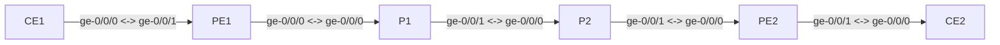

# Session 8 — Topology

## Diagram

Session 8 uses the same six-router topology as Sessions 4–7. No new GNS3 links are required. The change is logical: the PE routers gain a VRF that wraps the CE-facing interfaces.

## Device Summary

| Device | Role | Loopback | VRF |
|--------|------|----------|-----|
| PE1 | Provider Edge — VPN gateway (Site 1) | 10.0.0.1/32 | VPN-A (ge-0/0/1) |
| P1 | Provider Core — MPLS transit | 10.0.0.2/32 | none |
| P2 | Provider Core — MPLS transit | 10.0.0.3/32 | none |
| PE2 | Provider Edge — VPN gateway (Site 2) | 10.0.0.4/32 | VPN-A (ge-0/0/1) |
| CE1 | Customer Edge — Site 1 | 10.0.0.11/32 | none |
| CE2 | Customer Edge — Site 2 | 10.0.0.12/32 | none |

P1 and P2 require no configuration changes in this session. They forward on MPLS labels (outer transport label) exactly as in Session 7.

## Link Summary

| Link | Interface (A) | Interface (B) | Subnet |
|------|--------------|---------------|--------|
| CE1 - PE1 | CE1 ge-0/0/0.0 | PE1 ge-0/0/1.0 | 172.16.1.0/30 |
| PE1 - P1 | PE1 ge-0/0/0.0 | P1 ge-0/0/0.0 | 10.1.12.0/30 |
| P1 - P2 | P1 ge-0/0/1.0 | P2 ge-0/0/0.0 | 10.1.23.0/30 |
| P2 - PE2 | P2 ge-0/0/1.0 | PE2 ge-0/0/0.0 | 10.1.34.0/30 |
| PE2 - CE2 | PE2 ge-0/0/1.0 | CE2 ge-0/0/0.0 | 172.16.2.0/30 |

## What Changes in Session 8

In Session 6, the CE-facing interface on each PE (`ge-0/0/1`) was a global interface — its routes went into `inet.0`. In Session 8:

- `ge-0/0/1` is assigned to the `VPN-A` routing instance on both PE1 and PE2
- Routes learned from CE on this interface go into `VPN-A.inet.0` instead of `inet.0`
- The PE's global table (`inet.0`) never sees customer prefixes
- P1 and P2 see no change — they continue to forward on LDP transport labels
