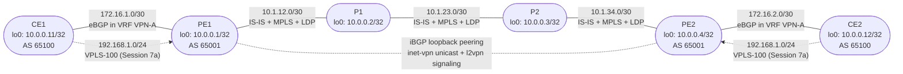

# Session 9 - Topology

## Diagram

Session 9 reuses the exact six-router topology from Sessions 4-8, with no new GNS3 links and no new nodes. Every protocol from every prior session is running concurrently: IS-IS in the core, MPLS/LDP transport, iBGP between PE1 and PE2 carrying `inet-vpn unicast` and `l2vpn signaling`, the VPN-A L3VPN, and the VPLS-100 L2VPN from Session 7a.

Solid lines are the provider backbone and the VRF-based PE-CE eBGP sessions from Session 8. Dashed lines are the iBGP control-plane relationship and the Session 7a VPLS-100 access links (`ge-0/0/2` on each PE, `ge-0/0/1` on each CE). All of these are already working at the start of this session - Part 0 only verifies the baseline, it does not add anything new.

## Device Summary

| Device | Role | Loopback | Services Running |
|--------|------|----------|-------------------|
| CE1 | Customer Edge (Site 1) | 10.0.0.11/32 | eBGP to PE1 in VPN-A; L2 test interface on VPLS-100 |
| PE1 | Provider Edge (LER) | 10.0.0.1/32 | IS-IS, LDP, iBGP to PE2, VRF VPN-A, VPLS-100 |
| P1 | Provider Core (LSR) | 10.0.0.2/32 | IS-IS, LDP, MPLS transit only - no VRF, no BGP |
| P2 | Provider Core (LSR) | 10.0.0.3/32 | IS-IS, LDP, MPLS transit only - no VRF, no BGP |
| PE2 | Provider Edge (LER) | 10.0.0.4/32 | IS-IS, LDP, iBGP to PE1, VRF VPN-A, VPLS-100 |
| CE2 | Customer Edge (Site 2) | 10.0.0.12/32 | eBGP to PE2 in VPN-A; L2 test interface on VPLS-100 |

## Link Summary

| Link | Left Device | Left Interface | Left Address | Right Device | Right Interface | Right Address | Layer |
|------|------------|----------------|---------------|--------------|-----------------|----------------|-------|
| CE1 - PE1 (VRF eBGP) | CE1 | ge-0/0/0 | 172.16.1.2/30 | PE1 | ge-0/0/1 | 172.16.1.1/30 | VPN-A |
| PE1 - P1 | PE1 | ge-0/0/0 | 10.1.12.1/30 | P1 | ge-0/0/0 | 10.1.12.2/30 | IS-IS + MPLS |
| P1 - P2 | P1 | ge-0/0/1 | 10.1.23.1/30 | P2 | ge-0/0/0 | 10.1.23.2/30 | IS-IS + MPLS |
| P2 - PE2 | P2 | ge-0/0/1 | 10.1.34.1/30 | PE2 | ge-0/0/0 | 10.1.34.2/30 | IS-IS + MPLS |
| PE2 - CE2 (VRF eBGP) | PE2 | ge-0/0/1 | 172.16.2.1/30 | CE2 | ge-0/0/0 | 172.16.2.2/30 | VPN-A |
| CE1 - PE1 (L2 service) | CE1 | ge-0/0/1 | 192.168.1.1/24 | PE1 | ge-0/0/2 | none (VPLS access) | VPLS-100 |
| CE2 - PE2 (L2 service) | CE2 | ge-0/0/1 | 192.168.1.2/24 | PE2 | ge-0/0/2 | none (VPLS access) | VPLS-100 |

## Fault Injection Points (Preview)

This session injects one fault at a time, in this order, each building on the last:

| Part | Fault Location | Layer Affected |
|------|----------------|-----------------|
| Part 1 | P1-P2 link, `10.1.23.0/30` | IS-IS adjacency between P1 and P2 |
| Part 2 | PE2 iBGP group toward PE1 | MP-BGP address family negotiation |
| Part 3 | PE2 `routing-instances VPN-A` | Route target import/export |

Each fault is injected only after the previous one is fixed and verified. P1 and P2 never carry VRF or BGP configuration in this topology - they remain pure IS-IS/MPLS transit routers throughout, exactly as established in Session 7 and confirmed unchanged in Session 8.
